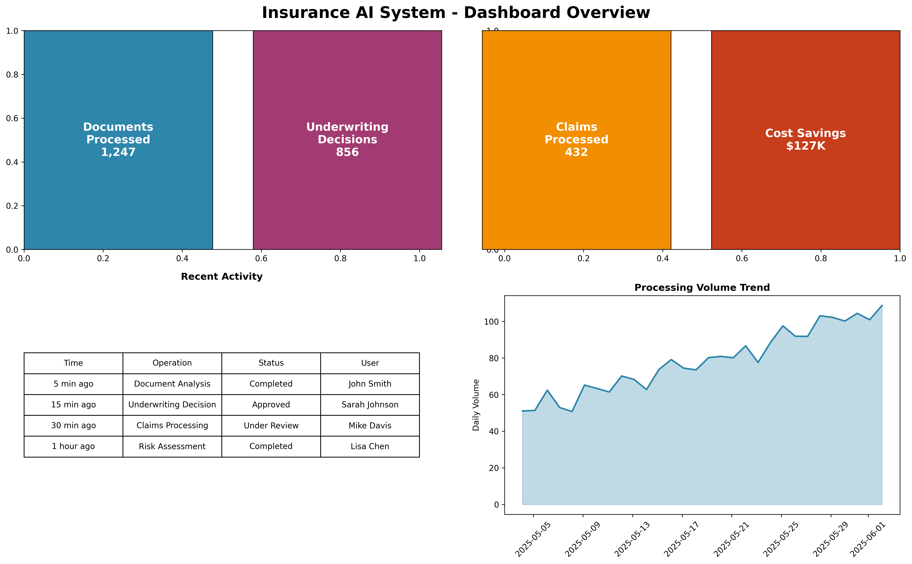
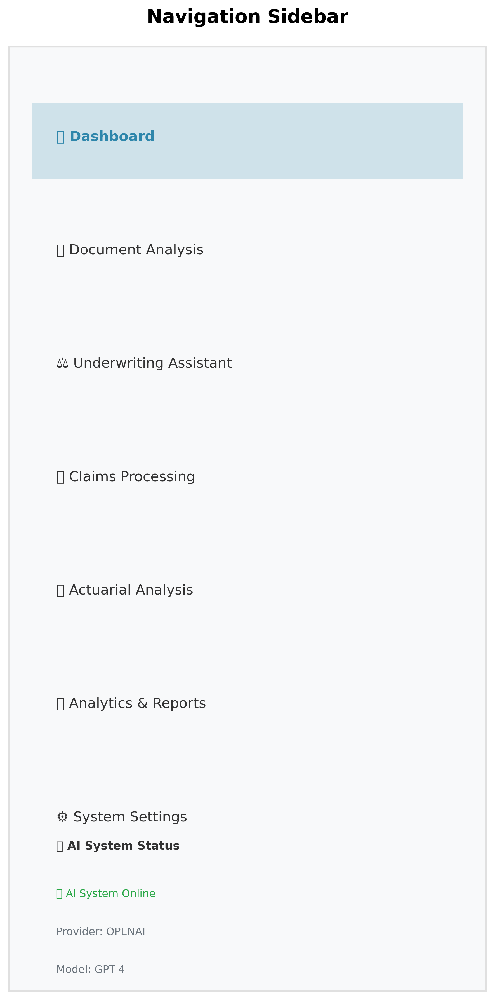
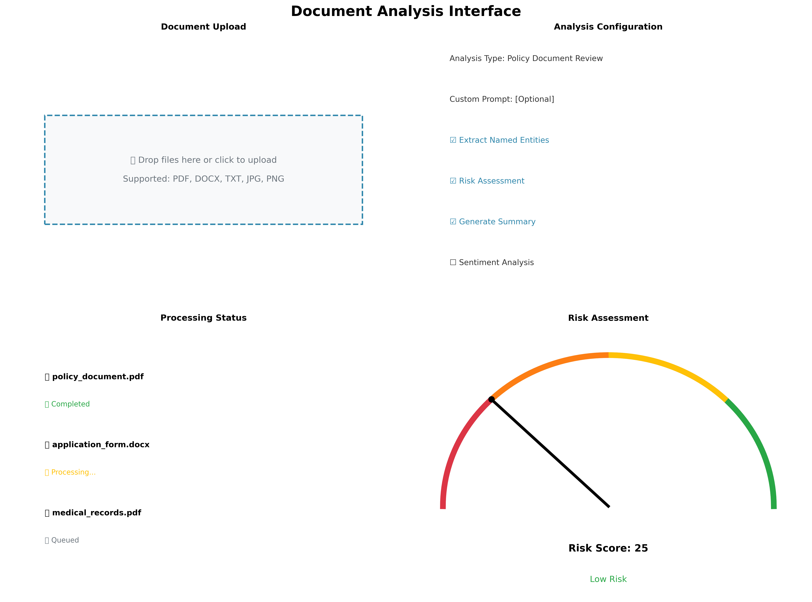
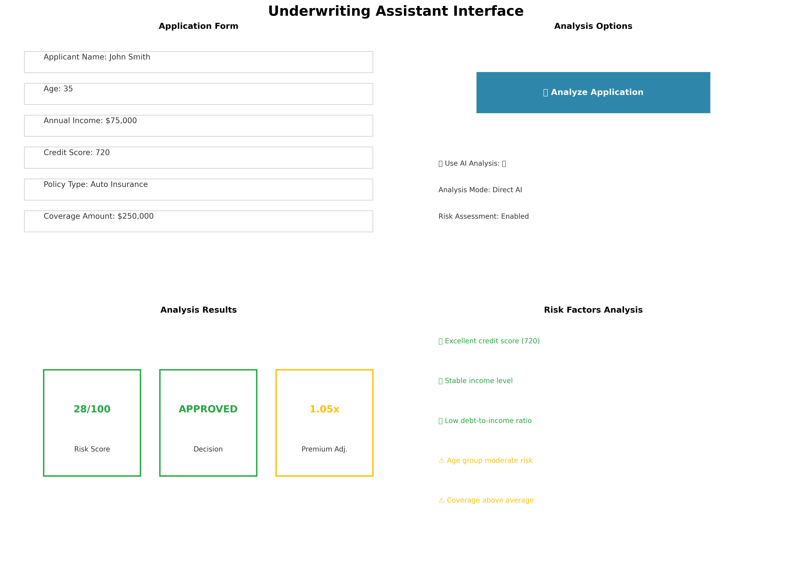
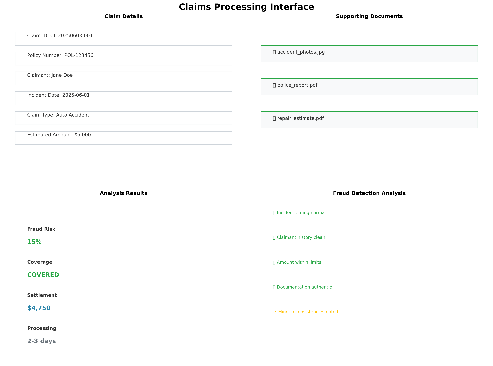
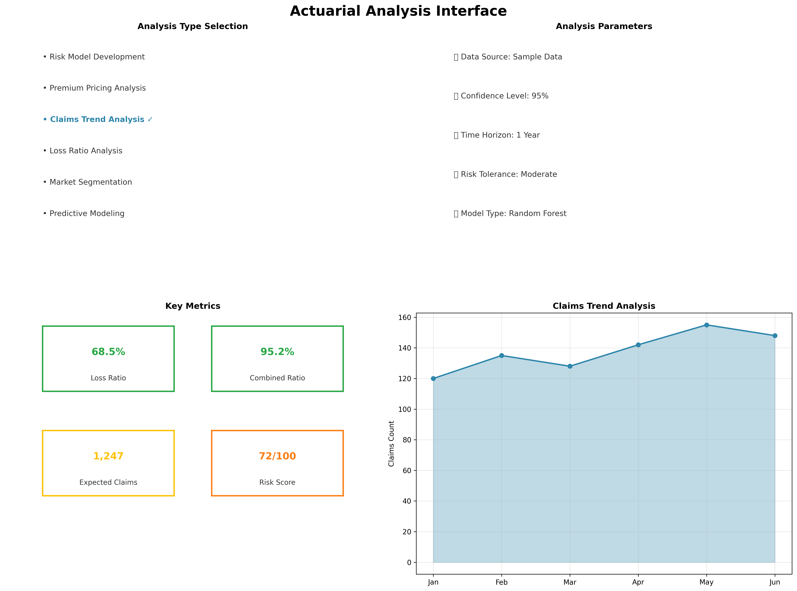
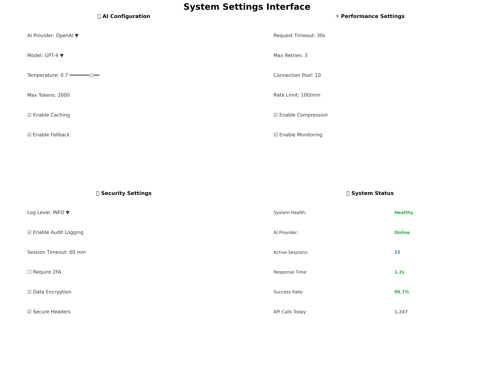
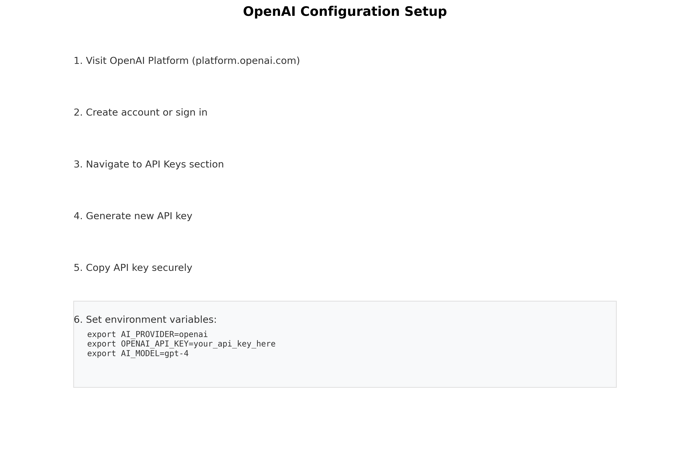

# 📚 Insurance AI System - Professional User Guide

## 🎯 Table of Contents

1. [Introduction](#introduction)
2. [Getting Started](#getting-started)
3. [Professional UI Overview](#professional-ui-overview)
4. [Document Analysis](#document-analysis)
5. [Underwriting Assistant](#underwriting-assistant)
6. [Claims Processing](#claims-processing)
7. [Actuarial Analysis](#actuarial-analysis)
8. [Analytics & Reports](#analytics--reports)
9. [System Settings](#system-settings)
10. [AI Configuration](#ai-configuration)
11. [Troubleshooting](#troubleshooting)
12. [Best Practices](#best-practices)

---

## 📖 Introduction

The Insurance AI System is a comprehensive, AI-enhanced platform designed for insurance professionals to streamline operations across underwriting, claims processing, and actuarial analysis. This guide will walk you through all features and capabilities of the system.

### 🎯 Key Features

- **AI-Powered Analysis**: Multi-provider AI support (OpenAI, Anthropic, Local LLMs)
- **Document Processing**: Upload and analyze insurance documents
- **Risk Assessment**: Intelligent underwriting decisions
- **Claims Intelligence**: Automated claims processing and fraud detection
- **Actuarial Analytics**: Advanced statistical analysis and modeling
- **Professional Dashboard**: Comprehensive business intelligence
- **Modular Architecture**: Scalable and configurable system

---

## 🚀 Getting Started

### System Requirements

- **Web Browser**: Chrome, Firefox, Safari, or Edge (latest versions)
- **Internet Connection**: Required for cloud AI providers
- **Screen Resolution**: Minimum 1280x720 (recommended 1920x1080)

### Accessing the System

1. **Professional UI**: Navigate to the professional interface
   ```
   http://your-domain.com/professional
   ```

2. **Standard UI**: Access the standard interface
   ```
   http://your-domain.com/
   ```

3. **Local Development**: For local installations
   ```
   streamlit run ui/professional_app.py --server.port 8501
   ```

### Initial Setup

1. **AI Configuration**: Set your AI provider credentials
2. **Institution Selection**: Choose your institution
3. **User Preferences**: Configure display and analysis options

---

## 🏢 Professional UI Overview

### Dashboard Layout



The professional dashboard provides a comprehensive view of your insurance operations:

#### 📊 Key Metrics Section
- **Documents Processed**: Total documents analyzed
- **Underwriting Decisions**: Applications processed
- **Claims Processed**: Claims handled
- **Cost Savings**: AI-driven efficiency gains

#### 📈 Performance Charts
- **Processing Volume Trend**: Daily/monthly processing statistics
- **Decision Distribution**: Breakdown of underwriting decisions
- **Claims Analysis**: Claims processing metrics

#### 📋 Recent Activity
- Real-time feed of system activities
- User actions and system responses
- Processing status updates

### Navigation Sidebar



The sidebar provides quick access to all system functions:

- **🏠 Dashboard**: Main overview and metrics
- **📄 Document Analysis**: Upload and analyze documents
- **⚖️ Underwriting Assistant**: Risk assessment tools
- **🔍 Claims Processing**: Claims management
- **📊 Actuarial Analysis**: Statistical modeling
- **📈 Analytics & Reports**: Business intelligence
- **⚙️ System Settings**: Configuration options

---

## 📄 Document Analysis

### Overview

The Document Analysis module allows you to upload insurance-related documents and receive AI-powered insights.



### Supported Document Types

- **PDF Files**: Policy documents, applications, reports
- **DOCX Files**: Word documents and forms
- **TXT Files**: Plain text documents
- **Images**: JPG, PNG (with OCR capabilities)

### Analysis Types

#### 1. General Document Analysis
- Document classification
- Key information extraction
- Content summarization

#### 2. Policy Document Review
- Coverage analysis
- Terms and conditions review
- Compliance checking

#### 3. Claims Document Processing
- Claim validation
- Supporting evidence analysis
- Fraud indicator detection

#### 4. Application Form Analysis
- Completeness verification
- Risk factor identification
- Data validation

#### 5. Medical Records Review
- Medical history analysis
- Risk assessment
- Condition classification

#### 6. Financial Statement Analysis
- Financial health assessment
- Income verification
- Debt analysis

### Step-by-Step Process

#### Step 1: Upload Documents


1. Click the **"Upload Documents"** area
2. Select one or multiple files
3. Supported formats will be highlighted
4. Files will appear in the upload queue

#### Step 2: Configure Analysis


1. **Analysis Type**: Select from the dropdown menu
2. **Custom Prompt**: Add specific instructions (optional)
3. **Advanced Options**: Configure additional settings
   - Extract Named Entities
   - Sentiment Analysis
   - Risk Assessment
   - Compliance Check
   - Generate Summary
   - Extract Key Data

#### Step 3: Process Documents


1. Click **"🚀 Analyze Documents"**
2. Progress bar shows processing status
3. Each document is processed individually
4. Results appear as processing completes

#### Step 4: Review Results


Each processed document shows:

- **Document Information**: Name, size, type
- **Processing Status**: Success/failure indicator
- **Key Findings**: Important insights discovered
- **Risk Assessment**: Risk score and level
- **Detailed Analysis**: Expandable results section

### Risk Assessment Gauge


The risk assessment includes:
- **Risk Score**: 0-100 scale
- **Risk Level**: Color-coded indicator
  - Green (0-25): Low Risk
  - Yellow (25-50): Medium Risk
  - Orange (50-75): High Risk
  - Red (75-100): Critical Risk

---

## ⚖️ Underwriting Assistant

### Overview

The Underwriting Assistant provides AI-powered risk assessment and decision support for insurance applications.



### Application Input Form

#### Personal Information
- **Applicant Name**: Full legal name
- **Age**: Applicant's age
- **Annual Income**: Gross annual income
- **Credit Score**: FICO or equivalent score

#### Policy Details
- **Policy Type**: Auto, Home, Life, Health, Business
- **Coverage Amount**: Requested coverage limit
- **Property Value**: For property insurance
- **Debt-to-Income Ratio**: Financial health indicator

#### Additional Information
- **Notes**: Any additional relevant information
- **Special Circumstances**: Unique factors to consider

### AI Analysis Process


#### Step 1: Data Input
1. Fill out the application form completely
2. Ensure all required fields are populated
3. Add any relevant additional information

#### Step 2: AI Processing
1. Click **"🎯 Analyze Application"**
2. AI system processes the application
3. Multiple risk factors are evaluated
4. Decision recommendation is generated

#### Step 3: Results Review


The analysis provides:

- **Risk Score**: Numerical risk assessment (1-100)
- **Decision**: Approve/Deny/Refer recommendation
- **Premium Adjustment**: Pricing modification factor

### Detailed Analysis Sections

#### 🎯 Risk Factors Analysis


**Positive Factors:**
- High credit score
- Stable income
- Low debt-to-income ratio
- Property in safe area

**Risk Factors:**
- Age-related claim frequency
- High coverage amount
- Geographic risk factors

#### 💰 Premium Calculation


- **Base Premium**: Standard rate for coverage
- **Risk Adjustment**: Multiplier based on risk assessment
- **Final Premium**: Calculated premium amount

#### 📋 Recommendations


- **Approval Status**: Recommended decision
- **Special Conditions**: Any required conditions
- **Review Schedule**: Follow-up recommendations

---

## 🔍 Claims Processing

### Overview

The Claims Processing module provides intelligent analysis and processing assistance for insurance claims.



### Claim Input Form

#### Claim Details
- **Claim ID**: Unique identifier
- **Policy Number**: Associated policy
- **Claimant Name**: Person filing claim
- **Incident Date**: When incident occurred

#### Incident Information
- **Claim Type**: Auto, Property, Theft, Fire, Water, Medical
- **Estimated Amount**: Initial damage estimate
- **Urgency Level**: Low, Medium, High, Critical
- **Description**: Detailed incident description

#### Supporting Documents
- **Upload Files**: Photos, reports, receipts
- **Document Types**: PDF, JPG, PNG, DOCX

### AI Analysis Process


#### Step 1: Claim Submission
1. Complete all required claim information
2. Upload supporting documentation
3. Set appropriate urgency level

#### Step 2: AI Processing
1. Click **"🔍 Process Claim"**
2. AI analyzes claim details and documents
3. Fraud detection algorithms run
4. Coverage verification performed

#### Step 3: Results Review


Key metrics displayed:
- **Fraud Risk**: Percentage risk of fraudulent claim
- **Coverage Status**: Covered/Not Covered determination
- **Settlement Amount**: Recommended payout
- **Processing Time**: Expected resolution timeframe

### Detailed Analysis Sections

#### 🔍 Fraud Detection Analysis


**Fraud Indicators Checked:**
- Incident timing and location patterns
- Claimant history and behavior
- Claim amount vs. policy limits
- Documentation quality and authenticity

**Risk Assessment:**
- Overall fraud risk percentage
- Specific suspicious patterns
- Documentation verification results

#### 📋 Coverage Analysis


**Policy Coverage Review:**
- Incident covered under policy terms
- Policy status and premium payments
- Claim within policy limits
- Applicable exclusions

**Settlement Calculation:**
- Estimated damage amount
- Applicable deductible
- Recommended settlement amount

#### ⚡ Next Steps


**Recommended Actions:**
1. Approve/deny claim decision
2. Required inspections or investigations
3. Payment processing timeline
4. Communication with claimant

---

## 📊 Actuarial Analysis

### Overview

The Actuarial Analysis module provides advanced statistical analysis and risk modeling capabilities.



### Analysis Types

#### 1. Risk Model Development
- Statistical risk modeling
- Predictive analytics
- Model validation

#### 2. Premium Pricing Analysis
- Rate adequacy assessment
- Competitive analysis
- Profitability modeling

#### 3. Claims Trend Analysis
- Historical trend analysis
- Seasonal patterns
- Emerging risk identification

#### 4. Loss Ratio Analysis
- Portfolio performance
- Segment analysis
- Profitability assessment

#### 5. Market Segmentation
- Customer segmentation
- Risk classification
- Pricing optimization

#### 6. Predictive Modeling
- Machine learning models
- Forecasting
- Scenario analysis

### Data Input Options


#### Upload CSV File
1. Prepare data in CSV format
2. Upload file using file uploader
3. Preview data before analysis

#### Use Sample Data
1. Select sample dataset option
2. System generates representative data
3. Immediate analysis capability

#### Connect to Database
1. Configure database connection
2. Select data tables and fields
3. Real-time data analysis

### Analysis Parameters


#### Statistical Settings
- **Confidence Level**: 90%-99% range
- **Time Horizon**: 3 months to 5 years
- **Risk Tolerance**: Conservative/Moderate/Aggressive
- **Model Type**: GLM, Random Forest, Neural Network

### Results Presentation

#### 📊 Summary Tab


Key performance indicators:
- **Loss Ratio**: Claims vs. premiums
- **Combined Ratio**: Overall profitability
- **Expected Claims**: Projected claim volume
- **Risk Score**: Portfolio risk assessment
- **Premium Adequacy**: Rate sufficiency
- **Profit Margin**: Expected profitability

#### 📈 Visualizations Tab


Interactive charts and graphs:
- **Claims by Age Group**: Demographic analysis
- **Premium Distribution**: Rate spread analysis
- **Claims Trend**: Time series analysis
- **Risk Segmentation**: Portfolio breakdown

#### 🔍 Insights Tab


**Risk Segmentation Analysis:**
- High-risk vs. low-risk segments
- Geographic concentration analysis
- Demographic risk factors

**Predictive Indicators:**
- Correlation analysis
- Leading indicators
- Seasonal patterns

**Emerging Trends:**
- Technology impact
- Climate-related risks
- Market developments

#### 📋 Recommendations Tab


**Immediate Actions (0-3 months):**
- Pricing adjustments
- Underwriting criteria updates
- Risk concentration management

**Medium-term Initiatives (3-12 months):**
- Model development
- Product enhancements
- Market expansion

**Long-term Strategy (1+ years):**
- Technology investments
- Partnership development
- Regulatory preparation

---

## 📈 Analytics & Reports

### Overview

The Analytics & Reports module provides comprehensive business intelligence and reporting capabilities.


### Report Types

#### 1. Executive Dashboard
- High-level KPIs
- Performance summaries
- Trend analysis

#### 2. Underwriting Performance
- Application processing metrics
- Decision accuracy
- Risk assessment effectiveness

#### 3. Claims Analysis Report
- Claims processing efficiency
- Settlement accuracy
- Fraud detection performance

#### 4. Financial Performance
- Revenue analysis
- Profitability metrics
- Cost management

#### 5. Risk Management Report
- Portfolio risk assessment
- Concentration analysis
- Emerging risks

#### 6. Regulatory Compliance
- Compliance metrics
- Audit preparation
- Regulatory reporting

### Report Generation Process


#### Step 1: Select Report Type
1. Choose from available report types
2. Each type has specific focus areas
3. Templates ensure consistency

#### Step 2: Set Date Range
1. Select start and end dates
2. Common ranges available (30 days, quarter, year)
3. Custom date ranges supported

#### Step 3: Generate Report
1. Click **"📊 Generate Report"**
2. System compiles data and analysis
3. Report generated in real-time

### Executive Dashboard Example


#### Key Performance Indicators
- **Total Premium**: Revenue metrics with growth indicators
- **Claims Ratio**: Loss ratio with trend analysis
- **New Policies**: Acquisition metrics
- **Customer Satisfaction**: Service quality metrics

#### Performance Trends
- **Daily Revenue Trend**: Time series analysis
- **Regional Performance**: Geographic breakdown
- **Product Line Analysis**: Segment performance

### Report Export Options


#### Available Formats
- **CSV**: Data tables for analysis
- **PDF**: Formatted reports for sharing
- **Excel**: Spreadsheet format with charts
- **PowerPoint**: Presentation format

#### Download Process
1. Select desired format
2. Click download button
3. File generated and downloaded automatically

---

## ⚙️ System Settings

### Overview

The System Settings module allows configuration of AI parameters, security settings, and system preferences.



### AI Configuration


#### AI Provider Selection
- **OpenAI**: GPT models (GPT-4, GPT-3.5-turbo)
- **Anthropic**: Claude models (Opus, Sonnet, Haiku)
- **Local LLM**: Self-hosted models (Llama2, Mistral)

#### Model Parameters
- **Temperature**: Creativity level (0.0-1.0)
- **Max Tokens**: Response length limit
- **Timeout**: Request timeout settings
- **Retries**: Maximum retry attempts

### Performance Settings


#### Optimization Options
- **Enable Caching**: Cache responses for performance
- **Enable Fallback**: Automatic provider switching
- **Connection Pooling**: Optimize API connections
- **Rate Limiting**: Control API usage

### Security Settings


#### Access Control
- **Log Level**: Debug, Info, Warning, Error
- **Audit Logging**: Track user actions
- **Session Timeout**: Automatic logout
- **Two-Factor Authentication**: Enhanced security

#### Data Protection
- **Encryption**: Data encryption settings
- **Backup**: Automated backup configuration
- **Retention**: Data retention policies

### System Status


#### Health Monitoring
- **System Health**: Overall system status
- **AI Provider Status**: Provider connectivity
- **Active Sessions**: Current user sessions
- **API Calls**: Usage statistics
- **Response Time**: Performance metrics
- **Success Rate**: Reliability metrics

---

## 🤖 AI Configuration

### Setting Up AI Providers

#### OpenAI Configuration



1. **Obtain API Key**:
   - Visit [OpenAI Platform](https://platform.openai.com)
   - Create account or sign in
   - Navigate to API Keys section
   - Generate new API key

2. **Configure in System**:
   ```bash
   export AI_PROVIDER=openai
   export OPENAI_API_KEY=your_api_key_here
   export AI_MODEL=gpt-4
   ```

3. **Model Options**:
   - **GPT-4**: Most capable, higher cost
   - **GPT-3.5-turbo**: Fast and cost-effective
   - **GPT-4-turbo**: Latest with improved capabilities

#### Anthropic Configuration


1. **Obtain API Key**:
   - Visit [Anthropic Console](https://console.anthropic.com)
   - Create account and verify
   - Generate API key

2. **Configure in System**:
   ```bash
   export AI_PROVIDER=anthropic
   export ANTHROPIC_API_KEY=your_api_key_here
   export AI_MODEL=claude-3-sonnet
   ```

3. **Model Options**:
   - **Claude-3-Opus**: Most capable
   - **Claude-3-Sonnet**: Balanced performance
   - **Claude-3-Haiku**: Fast and efficient

#### Local LLM Configuration


1. **Install Ollama**:
   ```bash
   curl -fsSL https://ollama.ai/install.sh | sh
   ```

2. **Download Models**:
   ```bash
   ollama pull llama2:7b
   ollama pull mistral:7b
   ```

3. **Configure in System**:
   ```bash
   export AI_PROVIDER=local
   export LOCAL_LLM_BASE_URL=http://localhost:11434
   export LOCAL_LLM_MODEL=llama2:7b
   ```

### AI Provider Comparison

| Feature | OpenAI | Anthropic | Local LLM |
|---------|--------|-----------|-----------|
| **Cost** | Pay-per-use | Pay-per-use | Free (after setup) |
| **Privacy** | Cloud-based | Cloud-based | Fully private |
| **Performance** | Excellent | Excellent | Good |
| **Latency** | Low | Low | Very low |
| **Customization** | Limited | Limited | Full control |
| **Reliability** | High | High | Depends on setup |

---

## 🔧 Troubleshooting

### Common Issues and Solutions

#### AI System Not Initializing


**Symptoms:**
- "AI System Offline" in sidebar
- Error messages during startup
- Failed analysis requests

**Solutions:**
1. **Check API Keys**:
   ```bash
   echo $OPENAI_API_KEY
   echo $ANTHROPIC_API_KEY
   ```

2. **Verify Network Connection**:
   - Test internet connectivity
   - Check firewall settings
   - Verify proxy configuration

3. **Review Configuration**:
   - Ensure correct provider setting
   - Validate model names
   - Check environment variables

#### Document Upload Issues


**Symptoms:**
- Files not uploading
- Processing failures
- Timeout errors

**Solutions:**
1. **File Size Limits**:
   - Maximum file size: 10MB
   - Compress large files
   - Split multi-page documents

2. **Supported Formats**:
   - PDF, DOCX, TXT, JPG, PNG only
   - Convert unsupported formats
   - Check file corruption

3. **Browser Issues**:
   - Clear browser cache
   - Disable ad blockers
   - Try different browser

#### Performance Issues


**Symptoms:**
- Slow response times
- Timeout errors
- System lag

**Solutions:**
1. **Enable Caching**:
   - Turn on response caching
   - Use local storage
   - Implement CDN

2. **Optimize Settings**:
   - Reduce max tokens
   - Lower temperature
   - Enable compression

3. **Resource Management**:
   - Monitor system resources
   - Scale infrastructure
   - Load balance requests

### Error Messages and Meanings

#### Common Error Codes

| Error Code | Meaning | Solution |
|------------|---------|----------|
| `AI_001` | API key invalid | Check and update API key |
| `AI_002` | Rate limit exceeded | Wait or upgrade plan |
| `AI_003` | Model not available | Check model name |
| `DOC_001` | File too large | Reduce file size |
| `DOC_002` | Unsupported format | Convert file format |
| `SYS_001` | Database connection failed | Check database settings |

### Getting Help

#### Support Channels

1. **Documentation**: Comprehensive guides and tutorials
2. **Community Forum**: User discussions and solutions
3. **Technical Support**: Direct assistance for issues
4. **Video Tutorials**: Step-by-step visual guides

#### Reporting Issues

When reporting issues, include:
- Error messages (full text)
- Steps to reproduce
- System configuration
- Browser and version
- Screenshots if applicable

---

## 💡 Best Practices

### Optimal Usage Guidelines

#### Document Analysis


1. **File Preparation**:
   - Ensure documents are clear and readable
   - Use high-resolution scans for images
   - Remove sensitive information if not needed
   - Organize files logically before upload

2. **Analysis Configuration**:
   - Choose specific analysis types for better results
   - Use custom prompts for specialized requirements
   - Enable relevant advanced options
   - Review settings before processing

3. **Result Interpretation**:
   - Review all analysis sections
   - Cross-reference with manual review
   - Document findings for future reference
   - Use insights for process improvement

#### Underwriting Optimization


1. **Data Quality**:
   - Ensure all required fields are complete
   - Verify accuracy of financial information
   - Include relevant additional context
   - Update information regularly

2. **Risk Assessment**:
   - Review AI recommendations carefully
   - Consider external factors not in data
   - Document decision rationale
   - Monitor decision outcomes

3. **Process Efficiency**:
   - Use batch processing for multiple applications
   - Standardize data collection procedures
   - Implement quality control checks
   - Track processing metrics

#### Claims Processing Excellence


1. **Documentation Standards**:
   - Collect comprehensive supporting documents
   - Ensure photos are clear and relevant
   - Verify document authenticity
   - Maintain organized file structure

2. **Fraud Prevention**:
   - Review AI fraud indicators carefully
   - Investigate suspicious patterns
   - Cross-reference with historical data
   - Document investigation findings

3. **Customer Service**:
   - Communicate processing timelines clearly
   - Provide regular status updates
   - Explain decisions thoroughly
   - Maintain professional correspondence

#### Actuarial Analysis Excellence


1. **Data Management**:
   - Ensure data quality and completeness
   - Use appropriate sample sizes
   - Validate data sources
   - Document data transformations

2. **Model Development**:
   - Choose appropriate statistical methods
   - Validate model assumptions
   - Test on out-of-sample data
   - Document model limitations

3. **Results Communication**:
   - Present findings clearly
   - Include confidence intervals
   - Explain methodology
   - Provide actionable recommendations

### Security Best Practices

#### Data Protection


1. **Access Control**:
   - Use strong passwords
   - Enable two-factor authentication
   - Limit user permissions appropriately
   - Regular access reviews

2. **Data Handling**:
   - Encrypt sensitive data
   - Use secure transmission protocols
   - Implement data retention policies
   - Regular security audits

3. **API Security**:
   - Protect API keys securely
   - Rotate keys regularly
   - Monitor API usage
   - Implement rate limiting

### Performance Optimization

#### System Performance


1. **Configuration Tuning**:
   - Optimize AI model parameters
   - Enable appropriate caching
   - Configure connection pooling
   - Monitor resource usage

2. **Workflow Optimization**:
   - Batch similar operations
   - Use appropriate analysis types
   - Implement parallel processing
   - Monitor processing times

3. **Maintenance**:
   - Regular system updates
   - Database optimization
   - Log file management
   - Performance monitoring

---

## 📞 Support and Resources

### Additional Resources

#### Documentation
- **API Reference**: Complete API documentation
- **Developer Guide**: Technical implementation details
- **Configuration Manual**: Detailed setup instructions
- **Video Tutorials**: Step-by-step visual guides

#### Community
- **User Forum**: Community discussions and solutions
- **Knowledge Base**: Frequently asked questions
- **Best Practices**: Industry-specific guidelines
- **Case Studies**: Real-world implementation examples

#### Training
- **Online Courses**: Comprehensive training programs
- **Webinars**: Regular feature updates and training
- **Certification**: Professional certification programs
- **Workshops**: Hands-on training sessions

### Contact Information

#### Technical Support
- **Email**: support@insurance-ai.com
- **Phone**: 1-800-AI-INSURE
- **Hours**: 24/7 technical support
- **Response Time**: < 4 hours for critical issues

#### Sales and Partnerships
- **Email**: sales@insurance-ai.com
- **Phone**: 1-800-AI-SALES
- **Hours**: Monday-Friday, 9 AM - 6 PM EST

#### Training and Education
- **Email**: training@insurance-ai.com
- **Phone**: 1-800-AI-LEARN
- **Hours**: Monday-Friday, 8 AM - 5 PM EST

---

*This user guide is regularly updated to reflect the latest features and improvements. For the most current version, please visit our documentation portal.*

**Version**: 2.0  
**Last Updated**: June 2025  
**Next Review**: September 2025

---

© 2025 Insurance AI System. All rights reserved.